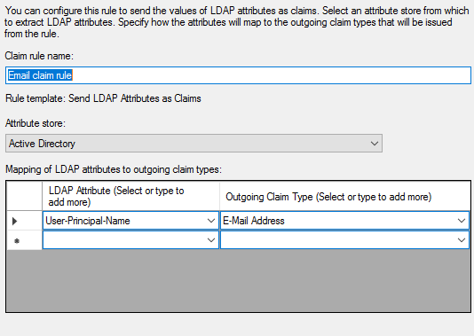
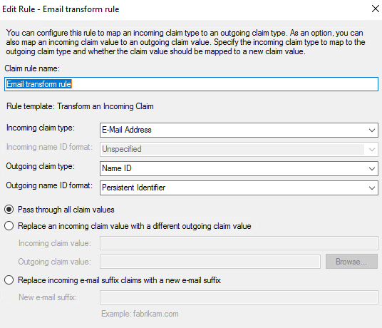

# Overview 
This section walks through the configuration of the ADFS Claims setup to federate with Azure AD Direct Federation. Most of the documentation came right from https://docs.microsoft.com/en-us/azure/active-directory/b2b/direct-federation-adfs

# Steps 
1. Login into ADFS virtual machine and launch the ADFS Management tool 
2. In the navigation pane, select Service > Claim Descriptions.
3. Under Actions, select Add Claim Description and specify the following values:
    * Display Name: Persistent Identifier
    * Claim identifier: urn:oasis:names:tc:SAML:2.0:nameid-format:persistent
    * Select the check box for Publish this claim description in federation metadata as a claim type that this federation service can accept.
    * Select the check box for Publish this claim description in federation metadata as a claim type that this federation service can send.  
    

4. Select Trust Relationships > Relying Party Trusts.
5. Under Actions, select Add Relying Party Trust.
    * Select Data Source, use the option Import data about the relying party published online . Use this URL- https://nexus.microsoftonline-p.com/federationmetadata/saml20/federationmetadata.xml. 
    * Leave other default selections. 
    * Select Close.

6. The Edit Claim Rules wizard should opens but if it doesn't then right click on the nexus.microsoftonline-p.com Trust and select Edit Claims Inssuance Policy  
    

7. Select Add Rule. 
    * Rule Type: Send LDAP Attributes as Claims. 
    * Configure Claim Rule:
        * Claim rule name: Email claim rule
        * Attribute store: Active Directory
        * LDAP Attribute: E-Mail-Addresses
        * Outgoing Claim Type: E-Mail Address  
    

8. Select Add Rule. 
    * Rule Type: Select Transform an Incoming Claim
    * Configure Claim Rule:
        * Claim rule name: Email transform rule
        * Incoming claim type: E-mail Address
        * Outgoing claim type: Name ID
        * Outgoing name ID format: Persistent Identifier  
    

9. Click through all OKs and Applies.  

10. The AD FS server is now configured for direct federation using the SAML 2.0 protocol.