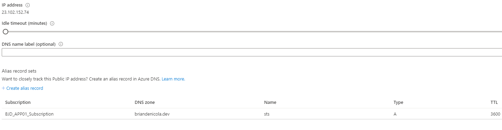

# Overview 

This section will walk through the creation of the ADFS server, promption to a AD Domain Controller, creation of user/service accounts and the installation of ADFS

An Windows 2019 Azure VM will be created that has a public IP Address 

#Pre-requisties 
* A DNS name such as _sts.adfsdomain.com_ or _adfs.adfsdomain.com_
    * This walk through will use sts.briandenicola.dev

# Steps
1. Create an SSL/TLS certificate for the selected DNS name. (If on Windows 10 then utilize Windows Subsystem for Linux):
    * curl https://get.acme.sh | sh
    * acme.sh --issue --dns -d _*.adfsdomain.com_ --yes-I-know-dns-manual-mode-enough-go-ahead-please
    * Create validation TXT record
    * acme.sh --toPkcs -d _*.adfsdomain.com_  
        
    
2. Create an Azure VM with a Public IP Address. 
    * The size of the machine doesn't matter for this demo but the B4ms is recommended
    * Here is a sample [ARM Template and PowerShell script](https://github.com/briandenicola/azure/tree/master/Scripts/DomainController_) to help setup the VM
        * Active Domain Name should match ADFS Domain -  _adfsdomain.com_ or briandenicola.dev

3. Open HTTPS (443) on the VM's NSG rule set

4. Assign the selected DNS name as a Alias record to the virtual machine's public IP address. This will be used in the next step for the public DNS record  
    

5. Create a DNS A records assigning the Alias to the public IP Adddress of the Virtual Machine
    * In this example, sts.briandenicola.dev is assigned to 23.102.152.74

6. Log into the virtual machine and confirm Domain has been configured correctly.
    * Prompt to Domain Controller if VM was created manually
    * Active Domain Name should match ADFS Domain -  _adfsdomain.com_ or briandenicola.dev  
        

7. Copy Certificate PFX file to VM and install it into the Computer Certificate Store

8. Create a Service Account for ADFS  
    

9. Install the AFS Role
    * Import-Module ServerManager
    * Install-windowsfeature adfs-federation –IncludeManagementTools

10. Configure ADFS 
    * Select the _*.adfsdomain.com_ certificate  
        

    * Select the service account created  
        

