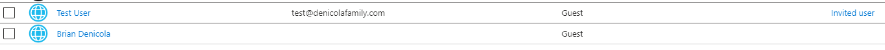
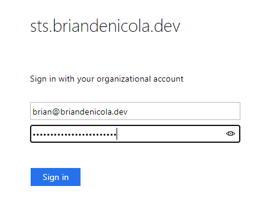

# Overview 
This section walks through the federation of Azure AD with the ADFS server previously configured

# Pre-requisties 
* Download the ADFS metadata file. The URL will be listed in the ADFS Management Console under ADFS > Service > Endpoint
    * Should be in the form https://_sts.adfsdomain.com_/FederationMetadata/2007-06/FederationMetadata.xml
    * Invoke-WebRequest -UseBasicParsing -Uri https://sts.briandenicola.dev/FederationMetadata/2007-06/FederationMetadata.xml -OutFile .\FederationMetadata.xml

# Azure AD Steps
1. Log into the Azure AD tenanat as a global Administrator and navigate to [External Identities](https://portal.azure.com/#blade/Microsoft_AAD_IAM/CompanyRelationshipsMenuBlade/IdentityProviders)
2. Click 'New SAML/WS-Fed Idp'
3. Select 'SAML' for Identity Provider Protocol 
4. Domain Name for Federation _sts.adfsdomain.com_ or _adfs.adfsdomain.com_
5. Select 'Parse metadata file'
6. Upload FederationMetadata.xml
7. Select Parse 
8. Save
    * Example  
    

# External Guest User
1. In the [Azure AD Users panel](https://portal.azure.com/#blade/Microsoft_AAD_IAM/UsersManagementMenuBlade/AllUsers), click 'New Guest User'
2. Enter a user name, First and last name
3. For Email Address, enter the email of user as defined in user's email attribute in Active Directory
    * For example: brian@briandenicola.dev  
    
4. The user will be added to the tenant's list of users. The acccount's source will be blank until the user logs into the tenant. Afterwards, it will update to 'Invited User'  
    
    

# Logon Experience 
1. The end user can test their access to the Azure AD tenant by going to the myapps.microsoft.com link
    * The Tenant ID will need to be appended to the URL so that MyApp knows what Tenant to lookup the user account - https://myapps.microsoft.com/?tenantid=834bd397-f53b-4659-xyz-1111111111
2. Enter the user's email address  
    
3. Redirection to their Idp Provider  
    
4. Enter the user password as set in Active Directory/ADFS  
    
5. Will be redirected back and granted access to the Azure AD tenant  
    
6. At first, the user may not have any applications defined but they have access to the Azure AD tenanat 
      
      
